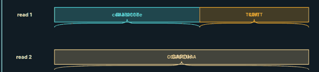
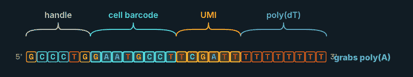
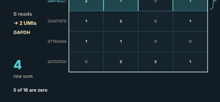
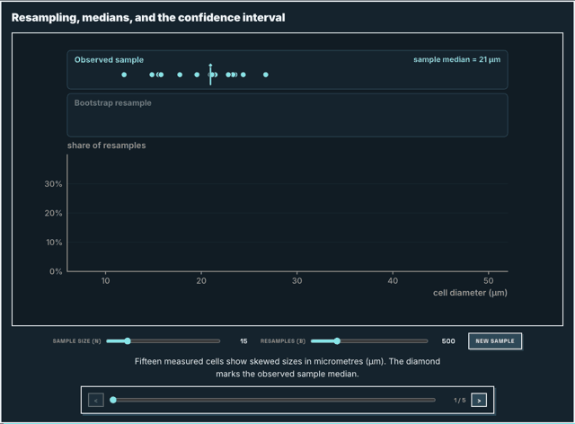
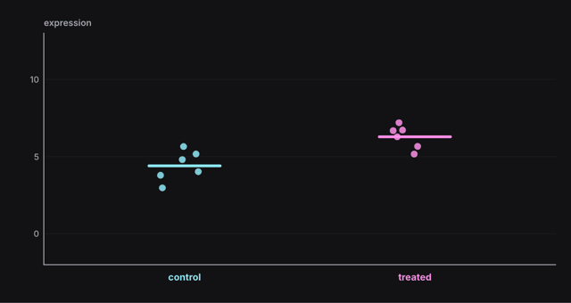
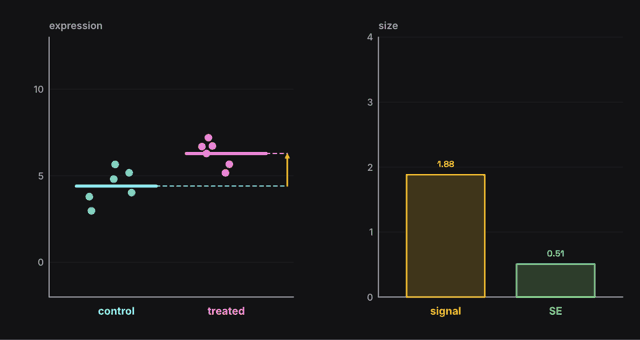
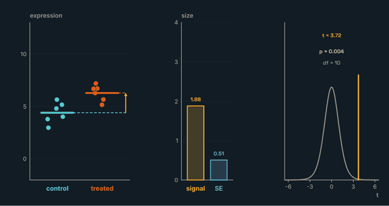
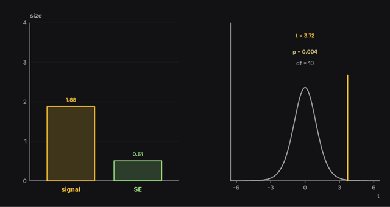
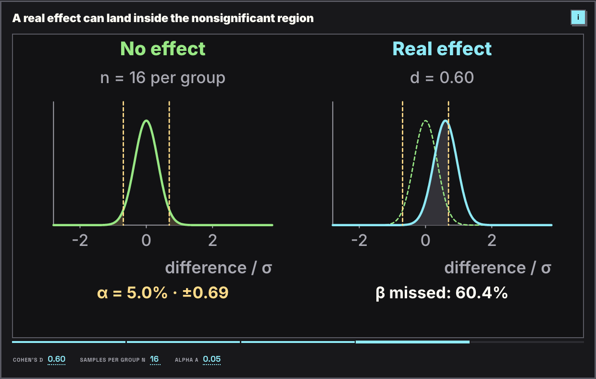
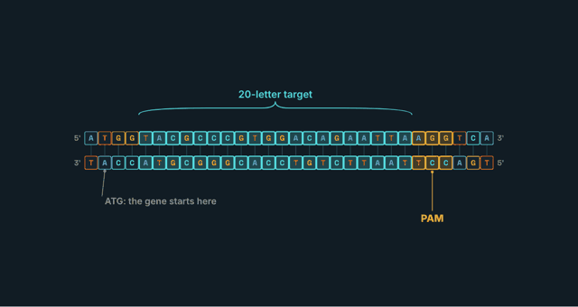

# Taste: what a finished page looks like

Read this before writing `story.js`, and again before every sheet review. The pictures are real failures from earlier test runs, next to the fix.

## The bar
- **The picture explains; text names.** One idea per step. Caption ≤ 28 words. No paragraph on the stage.
- **No sentence under the figure.** The caption opens the i sidebar. The stage labels alone must make the step readable.
- **No text before the first scene.** Title and one `sub` line, then the figure. (Study pages may open with tiles.)
- **Step 1 is one big figure.** Later panels arrive and the first one makes room. Never show empty axes waiting for later steps.
- **At most two plots side by side**, each ≥ 440 of the 1200 stage units wide. A third idea gets its own step or scene.
- **Plots fill their panel**: each ≥ 300 of the 675 stage units tall. Headings go in the scene title or the sidebar, not stacked above the axes. Text is never bigger than 36.
- **Details go in the i sidebar**, not on the stage: notation, what you see, how to read it, one thing to try. ≤ 120 words per step.
- **Every label has air.** Nothing touches anything: ≥ 8 px from other text, lines, and shape edges.
- **Every number on screen is computed**, never hand-typed.
- **Every symbol in a formula is explained in the sidebar**: each letter, each index (i = a gene, j = a sample), each operator (Σ, log₂, the bar over x̄) in plain words, with one example from the figure ("x for GeneA in S1 = 120"). Calc pages do this from `t.symbols`; on other pages put it in `info.notation`.

## Before → after

**1. A label on top of a segment.** Two words drawn in one box become unreadable.

Fix: `g.read` already writes the segment text. Name a segment with `g.brace` above or below it, never with a second `g.text` inside.

**2. Text touching an end mark.** "3′" runs into "grabs poly(A)".

Fix: put the note under the strand with `g.label(x, y, s, { to: [x, y] })`, or leave ≥ 12 units of gap after the end mark.

**3. A wrong number in a legend.** "12+ cells" was meant to be "2+ cells" with a count of 1 in front.

Fix: build legend strings from data in one template (`` `${n} with 2+ cells` ``), then read every legend on the sheet as a sentence.

**4. Side notes piled in a corner.** Five loose facts compete with the figure.

Fix: keep the one number that is the point of the step, placed next to the thing it describes. Move the rest to `info`.

**5. Empty panels on step 1.** The reader sees two blank boxes and an empty histogram.

Fix: `panels` (see `ref/kit.md`). Step 1 gets the whole stage:

A second plot arrives and the first one makes room:

**6. Three plots squeezed side by side.** Each is about 340 units wide: tall, thin, and hard to read.

Fix: **at most two plots side by side.** When a third arrives, the oldest one slides away (the runtime does this for `panels`). The bars that carry the result stay; the raw dots have done their job:

If a plot cannot fit at ≥ 440 units wide, give it its own step or scene. The audit fails any plot narrower than that.

**7. Short plots under giant headings.** Headings at size 42 and readouts at 36 take half the height; the curves are thin strips.

Fix: labels 20, the one key number 26–34, default `panelPad`. The scene title already names the idea, so drop the per-panel heading or make it one 20-size label. The audit fails plots under 300 units tall and text above 36.

**8. Labels with leaders, away from the letters.** Each note sits in open space and points at its letter.

## Authoring rules
1. Place every label from the thing it names (`ax.sx(v)`, `dna.cx(i)`, `L.data.x`), never from guessed pixels.
2. A label next to a small shape uses `g.label` with `to`. A span of letters or a segment uses `g.brace`.
3. At most one new annotation per step. If a step needs two, split it into two steps.
4. Multi-panel scenes use `panels` and draw each panel with `g.panel(id, box => ...)`. Never split the stage by hand.
5. Size marks (dot jitter, average lines, bar widths) in stage units, not data units, so a panel that grows or shrinks still looks right.
6. Every on-stage number comes from a variable in `draw` or `PROFF_DATA`.
7. `free: true` only for boxes that hold their own text. Never use it to silence a warning.
8. Sizes on the stage: labels 20, minor notes 18, tick labels 16, the one key number 26–34, never above 36 (the audit fails it).

## Self-review (required before you report)
Usage is not the constraint; mistakes are. **If you are a fast or low-cost model, run at least two full review rounds even when the first looks clean.**

1. `check.py` must print `0 warnings` (exit code 0). Any warning means not done.
2. Open **every** sheet image. For each frame (`s1.1`, `s1.2`, …), write one line in your notes:
   `frame · every text item you can see · touching or overlapping? · empty area > 1/3 of the stage? · the step reads without its caption?`
3. Recompute every number on screen from the data or the code.
4. Check every plot is wide enough to read: no tall, thin plots, no squeezed tick labels.
5. Read the sidebar sheet (`snaps/sheet-sidebar-*.png`, one panel per step): every symbol, index and operator is named, with an example from the figure; nothing cramped or cut off.
6. Check that step 1 of each multi-panel scene shows one big figure, and that no text block sits above the first scene.
7. Fix, rebuild, recheck. Stop after 3 rounds on the same defect and report it.

Report line: `check: 0 warnings · sheets viewed N/N · frames listed M`. If you did not list every frame, write `not reviewed`.
